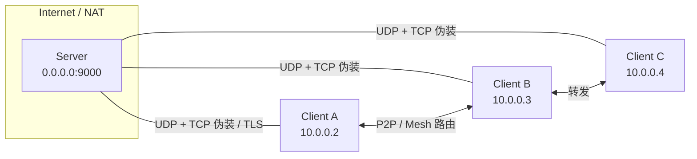

# 轻量级内网隧道

一个使用 Go 语言开发的轻量级内网隧道工具，使用 **UDP 传输并添加伪装 TCP 头部**来绕过防火墙，同时支持 **AES-256-GCM 加密**和 FEC 纠错功能，适用于在多个服务器之间建立安全的虚拟内网连接。

## 项目简介

Lightweight Tunnel 通过 **UDP + TCP 头部伪装** 来规避常见的 UDP 封锁，并内置 **AES-256-GCM 加密** 与 **FEC 前向纠错**，在保证安全的同时兼顾低延迟和稳定性。

## 网络拓扑速览



## 主要特性

- 🚀 **轻量高效** - 资源占用少，适合低配置服务器
- 🔐 **AES-256-GCM 加密** - 使用 `-k` 参数启用加密，防止未授权连接
- 🛡️ **TLS 传输模式** - 可选的 TLS 证书传输通道，适合需要纯 TCP/TLS 的环境
- 🎭 **TCP 伪装** - UDP 数据包伪装成 TCP 连接，可穿透防火墙
- ⚡ **UDP 传输** - 实际使用 UDP 传输，避免 TCP-over-TCP 问题
- 🛡️ **FEC 纠错** - 自动纠正丢包，提升弱网环境下的稳定性
- 🌐 **多客户端** - 支持多个客户端同时连接，客户端之间可互相通信
- 🔄 **P2P 直连** - 支持客户端之间 P2P 直接连接，无需服务器中转
- 🧠 **智能路由** - 自动选择最优路径：P2P、中继或服务器转发
- 🛰️ **NAT 识别与优化** - 自动检测 NAT 类型（Full/Restricted/Port-Restricted/Symmetric），优先由低限制 NAT 一侧主动打洞，并在双方对称时自动回退服务器中转
- 🌐 **网状网络** - 支持通过其他客户端中继流量，实现多跳转发
- ⚡ **高性能** - 基于 Go 协程实现高并发处理
- 🎯 **简单易用** - 支持命令行和配置文件两种方式

## 已补齐的功能清单

- ✅ **TLS 传输模式**：现已支持 `-tls` 与证书/密钥，满足需要纯 TCP/TLS 的场景，可配合 `-tls-skip-verify` 在测试环境跳过校验。
- ✅ **P2P 连接超时可配置**：新增 `-p2p-timeout`（默认 5s），直连超过超时会自动回退到服务器转发，避免长时间等待。
- ✅ **动态密钥轮换**：服务端可通过 `-key-rotate` 周期性下发 30 位随机密钥，客户端收到后自动切换并确认，旧密钥在宽限期后失效。
- ✅ **无 TLS 场景的 DPI/GFW 混淆**：当关闭 TLS 但启用 `-k` 时默认自动套用 TLS-like 混淆与随机填充，凭借密钥即可绕过常见 DPI/GFW 检测。

### 动态密钥轮换与混淆快速说明

- 服务端开启轮换：`-key-rotate <秒>`（例：900 表示 15 分钟轮换一次），可选 `-key-rotate-grace <秒>` 控制旧密钥保活窗口（默认 5 秒）。
- 客户端无需额外参数：只需配置初始密钥 `-k <初始密钥>`；收到更新后会自动切换并发送确认，切换成功后旧密钥在宽限期到期即失效。
- 轮换密钥长度：固定 30 个字符（字母数字混合随机生成）。
- 非 TLS 但启用 `-k` 时，程序自动开启 TLS-like 混淆与随机填充，降低 DPI/GFW 识别概率，无需额外配置。

## 适用场景

- 🏢 企业或分支机构之间的安全互联
- 🏠 家庭服务器 / NAS 远程访问
- 🎮 低延迟游戏联机
- 🔧 异地开发测试快速组网
- 🌐 多客户端 Hub 互访或网状路由场景

## 🔐 安全说明

### 推荐：使用 `-k` 参数加密

使用 `-k` 参数可以启用 **AES-256-GCM 加密**，这是推荐的安全配置：

- 若环境需要严格的传输层合规，可叠加 `-tls` 与证书文件；`-k` 仍用于隧道负载端到端加密。

```bash
# 服务端（启用加密）
sudo ./lightweight-tunnel -m server -l 0.0.0.0:9000 -t 10.0.0.1/24 -k "your-secret-key"

# 客户端（使用相同密钥）
sudo ./lightweight-tunnel -m client -r <服务器IP>:9000 -t 10.0.0.2/24 -k "your-secret-key"
```

**加密的优势：**
- ✅ 所有隧道流量（包括 P2P）都会被加密
- ✅ 防止未授权用户连接到您的隧道
- ✅ 防止中间人攻击和流量窃听
- ✅ 密钥不匹配的连接会被自动拒绝
- ✅ NAT 打洞协商、服务器中转同样在加密信道内完成

**注意：** 服务端和客户端必须使用相同的密钥，否则无法通信。

### 无加密模式（仅用于测试）

如果不使用 `-k` 参数，隧道将不加密，**不建议在生产环境使用**：

```bash
# ⚠️ 警告：此模式无加密，仅用于测试
sudo ./lightweight-tunnel -m server -l 0.0.0.0:9000 -t 10.0.0.1/24
```

详见 [SECURITY.md](SECURITY.md)。

## 快速开始

### 系统要求

- Linux 系统（需要 TUN 设备支持）
- Root 权限（用于创建和配置 TUN 设备）
- Go 1.19+ （仅编译时需要）

### 安装

```bash
# 克隆仓库
git clone https://github.com/C018/lightweight-tunnel.git
cd lightweight-tunnel

# 编译
go build -o lightweight-tunnel ./cmd/lightweight-tunnel

# 或者直接安装
go install ./cmd/lightweight-tunnel
```

### 作为系统服务运行（开机自启）

> 提示：安装 systemd 服务时会把 **当前二进制的绝对路径** 和 **指定的配置文件路径** 写入单元文件，安装后如果移动二进制或配置文件，请重新执行安装命令。

```bash
# 1) 将二进制放到固定路径（推荐 /usr/local/bin）
go build -o lightweight-tunnel ./cmd/lightweight-tunnel
sudo install -m 755 ./lightweight-tunnel /usr/local/bin/lightweight-tunnel

# 2) 准备配置（示例路径，需 root）
sudo mkdir -p /etc/lightweight-tunnel
sudo /usr/local/bin/lightweight-tunnel -g /etc/lightweight-tunnel/config.json

# 3) 安装并启动 systemd 服务（绑定指定配置）
sudo /usr/local/bin/lightweight-tunnel -service install -c /etc/lightweight-tunnel/config.json
#    可选：自定义服务名与配置路径
# sudo /usr/local/bin/lightweight-tunnel -service install -service-name tunnel-a -c /etc/lightweight-tunnel/tunnel-a.json   # 或 -service-config /etc/lightweight-tunnel/tunnel-a.json

# 4) 控制命令
sudo /usr/local/bin/lightweight-tunnel -service status
sudo /usr/local/bin/lightweight-tunnel -service restart
sudo /usr/local/bin/lightweight-tunnel -service uninstall   # 需要时移除服务
```

说明：
- `-service install` 会在 `/etc/systemd/system/<服务名>.service` 中写入 ExecStart 与配置路径；二进制或配置移动后需重新安装服务。
- 默认服务名为 `lightweight-tunnel.service`，可通过 `-service-name <name>` 自定义，多隧道部署时为每个配置指定不同名称。
- 配置文件名可自定义，通过 `-service-config <path>` 或 `-c <path>` 指定任意路径和文件名，未显式指定时默认 `/etc/lightweight-tunnel/config.json`。
- 配置更新后执行 `sudo systemctl restart <服务名>` 生效，可用 `journalctl -u <服务名> -f` 查看运行日志。

### 基本使用

#### 场景一：带加密的安全隧道（推荐）

**服务端：**
```bash
sudo ./lightweight-tunnel -m server -l 0.0.0.0:9000 -t 10.0.0.1/24 -k "my-secret-key"
```

**客户端：**
```bash
sudo ./lightweight-tunnel -m client -r <服务器IP>:9000 -t 10.0.0.2/24 -k "my-secret-key"
```

**测试连接：**
```bash
# 在客户端执行
ping 10.0.0.1
```

#### 场景二：简单的点对点连接（仅测试用，无加密）

**服务端：**
```bash
sudo ./lightweight-tunnel -m server -l 0.0.0.0:9000 -t 10.0.0.1/24
```

**客户端：**
```bash
sudo ./lightweight-tunnel -m client -r <服务器IP>:9000 -t 10.0.0.2/24
```

**⚠️ 注意：** 此模式下流量未加密，任何人都可以连接。仅建议在测试环境使用。

#### 场景三：多客户端组网（带加密）

服务端默认支持多客户端连接，所有客户端可以互相通信：

**服务端：**
```bash
sudo ./lightweight-tunnel -m server -l 0.0.0.0:9000 -t 10.0.0.1/24 -k "shared-secret"
```

**客户端 1：**
```bash
sudo ./lightweight-tunnel -m client -r <服务器IP>:9000 -t 10.0.0.2/24 -k "shared-secret"
```

**客户端 2：**
```bash
sudo ./lightweight-tunnel -m client -r <服务器IP>:9000 -t 10.0.0.3/24 -k "shared-secret"
```

**客户端 3：**
```bash
sudo ./lightweight-tunnel -m client -r <服务器IP>:9000 -t 10.0.0.4/24 -k "shared-secret"
```

连接后，客户端之间可以直接通信：
```bash
# 在客户端 1 上 ping 客户端 2
ping 10.0.0.3

# 在客户端 1 上 SSH 到客户端 3
ssh user@10.0.0.4
```

#### 场景四：P2P 直连模式（带加密）

启用 P2P 模式，客户端之间会自动尝试建立直接连接，无需通过服务器中转。P2P 流量同样会被加密：

**服务端：**
```bash
sudo ./lightweight-tunnel -m server -l 0.0.0.0:9000 -t 10.0.0.1/24 -k "p2p-secret"
```

**客户端 1（启用 P2P）：**
```bash
sudo ./lightweight-tunnel -m client -r <服务器IP>:9000 -t 10.0.0.2/24 -p2p -k "p2p-secret"
```

**客户端 2（启用 P2P）：**
```bash
sudo ./lightweight-tunnel -m client -r <服务器IP>:9000 -t 10.0.0.3/24 -p2p -k "p2p-secret"
```

P2P 连接建立后：
- 流量直接在客户端之间传输，延迟更低
- **所有 P2P 流量都会被加密**
- 减少服务器带宽和 CPU 负载
- P2P 失败时自动回退到服务器转发
- 路由优先级：本地局域网直连 > NAT 打洞直连 > 服务器中转；双方均为对称 NAT 时自动走服务器

**查看路由状态：**
```bash
# 日志会显示路由统计
Routing stats: 2 peers, 1 direct, 0 relay, 1 server
# 表示：2个对等节点，1个P2P直连，0个中继，1个服务器路由
```

路由选择会结合 NAT 类型识别：较“开放”的 NAT 会优先主动打洞；双方都是对称 NAT 时自动回退服务器中转。

#### 场景五：TLS 传输模式（需证书，适合纯 TCP/TLS 环境）

**服务端：**
```bash
sudo ./lightweight-tunnel -m server -l 0.0.0.0:9000 -t 10.0.0.1/24 \
    -tls -tls-cert /path/server.crt -tls-key /path/server.key
```

**客户端：**
```bash
sudo ./lightweight-tunnel -m client -r <服务器IP>:9000 -t 10.0.0.2/24 \
    -tls -tls-skip-verify=false
# 如使用自签证书，可额外提供 CA/客户端证书：
# -tls-cert /path/ca_or_client.crt [-tls-key /path/client.key]
```

> 说明：TLS 模式走 TCP 传输并使用长度帧封装，仍可结合 `-k` 对隧道负载进行 AES-256-GCM 加密。

### 使用配置文件

#### 生成示例配置

```bash
./lightweight-tunnel -g config.json
# 会生成 config.json（服务端）和 config.json.client（客户端）
```

#### 服务端配置示例

```json
{
  "mode": "server",
  "local_addr": "0.0.0.0:9000",
  "tunnel_addr": "10.0.0.1/24",
  "key": "your-secret-key",
  "key_rotate_seconds": 900,
  "key_rotate_grace": 5,
  "mtu": 1400,
  "fec_data": 10,
  "fec_parity": 3,
  "timeout": 30,
  "keepalive": 10,
  "send_queue_size": 1000,
  "recv_queue_size": 1000,
  "multi_client": true,
  "max_clients": 100,
  "client_isolation": false
}
```

**重要说明：**
- `key`：加密密钥，服务端和客户端必须相同
- `key_rotate_seconds` / `key_rotate_grace`：动态密钥轮换间隔与宽限期（服务端），设置为 `0` 表示关闭
- `multi_client`：未指定时默认为 `true`，允许多个客户端同时连接
- 如需限制为单客户端模式，显式设置为 `false`

#### 客户端配置示例

```json
{
  "mode": "client",
  "remote_addr": "<服务器IP>:9000",
  "tunnel_addr": "10.0.0.2/24",
  "key": "your-secret-key",
  "mtu": 1400,
  "fec_data": 10,
  "fec_parity": 3,
  "timeout": 30,
  "keepalive": 10,
  "send_queue_size": 1000,
  "recv_queue_size": 1000,
  "p2p_enabled": true,
  "p2p_port": 0,
  "enable_mesh_routing": true,
  "max_hops": 3,
  "route_update_interval": 30,
  "p2p_timeout": 5
}
```

**加密配置说明：**
- `key`：加密密钥，必须与服务端相同

**P2P 配置说明：**
- `p2p_enabled`：启用 P2P 直连（默认：true）
- `p2p_port`：UDP 端口，0 表示自动选择
- `enable_mesh_routing`：启用网状路由（默认：true）
- `max_hops`：最大跳数（默认：3）
- `route_update_interval`：路由更新间隔秒数（默认：30）
- `p2p_timeout`：P2P 连接超时（秒），默认 5

#### 使用配置文件运行

```bash
sudo ./lightweight-tunnel -c config.json
```

## 配置说明

### 命令行参数

| 参数 | 说明 | 默认值 |
|------|------|--------|
| `-c` | 配置文件路径 | - |
| `-m` | 模式：server 或 client | server |
| `-l` | 监听地址（服务端） | 0.0.0.0:9000 |
| `-r` | 服务器地址（客户端） | - |
| `-t` | 隧道 IP 地址和子网掩码 | 10.0.0.1/24 |
| `-k` | **加密密钥**（推荐使用） | - |
| `-mtu` | MTU 大小 | 1400 |
| `-fec-data` | FEC 数据分片数 | 10 |
| `-fec-parity` | FEC 校验分片数 | 3 |
| `-send-queue` | 发送队列大小 | 1000 |
| `-recv-queue` | 接收队列大小 | 1000 |
| `-multi-client` | 启用多客户端支持（服务端） | true |
| `-max-clients` | 最大客户端数量（服务端） | 100 |
| `-client-isolation` | 客户端隔离模式 | false |
| `-p2p` | 启用 P2P 直连 | true |
| `-p2p-port` | P2P UDP 端口（0=自动） | 0 |
| `-p2p-timeout` | P2P 连接超时（秒），超时后回退服务器转发 | 5 |
| `-mesh-routing` | 启用网状路由 | true |
| `-max-hops` | 最大跳数 | 3 |
| `-route-update` | 路由更新间隔（秒） | 30 |
| `-tls` | 启用 TLS 传输加密（使用 TCP + 长度帧，可与 `-k` 叠加） | false |
| `-tls-cert` | TLS 证书文件（服务端必填，客户端可用于自签 CA/客户端证书） | - |
| `-tls-key` | TLS 私钥文件（服务端必填；与 `-tls-cert` 搭配可用于客户端双向认证） | - |
| `-tls-skip-verify` | 跳过证书验证（客户端，不安全，仅测试时使用） | false |
| `-obfs` | 启用 TLS 记录混淆（两端都要开启，用于抗 DPI/GFW） | false |
| `-obfs-padding` | 混淆时的最大随机填充字节数 | 16 |
| `-tun` | 指定 TUN 设备名（为空则自动分配 tun0、tun1...） | - |
| `-routes` | 逗号分隔的 CIDR 列表，表示可经由本节点访问的其他网段（例如本地网卡或其他 TUN） | - |
| `-service` | systemd 服务操作：install/uninstall/start/stop/restart/status | - |
| `-service-name` | systemd 服务名 | lightweight-tunnel |
| `-service-config` | 安装/控制服务使用的配置文件路径 | /etc/lightweight-tunnel/config.json |
| `-v` | 显示版本 | - |
| `-g` | 生成示例配置文件 | - |

配置文件额外字段：
- `p2p_timeout`：P2P 连接超时时间（秒），默认 5（同 `-p2p-timeout`）。

### 广播额外网段（访问其他 TUN/网卡）

如果客户端后面还有其他网段需要通过隧道提供给其他节点访问（例如本地 LAN 或另一条 TUN），可以使用 `advertised_routes` 或 `-routes` 进行声明，服务端会基于这些前缀进行转发：

```bash
# 客户端示例：将 192.168.1.0/24 经由隧道提供给其他节点访问
sudo ./lightweight-tunnel -m client -r <SERVER_IP>:9000 -t 10.0.0.2/24 \
    -routes "192.168.1.0/24"
```

> 说明：当前路由广播由客户端上报给服务端后用于服务端转发路径（包含客户端之间的转发），P2P 广播仅记录日志，不会直接更新路由表。

使用配置文件示例：

```json
// server.json
{
  "mode": "server",
  "local_addr": "0.0.0.0:9000",
  "tunnel_addr": "10.0.0.1/24",
  "key": "your-secret-key",
  "advertised_routes": []
}
```

```json
// client.json
{
  "mode": "client",
  "remote_addr": "<服务器IP>:9000",
  "tunnel_addr": "10.0.0.2/24",
  "key": "your-secret-key",
  "advertised_routes": [
    "192.168.1.0/24",
    "10.10.0.0/16"
  ]
}
```

### 多客户端配置选项

**Hub 模式（默认，推荐带加密）：** 所有客户端可以互相通信
```bash
sudo ./lightweight-tunnel -m server -l 0.0.0.0:9000 -t 10.0.0.1/24 -k "my-key"
```

**客户端隔离模式：** 客户端只能与服务端通信，不能互访
```bash
sudo ./lightweight-tunnel -m server -l 0.0.0.0:9000 -t 10.0.0.1/24 -k "my-key" -client-isolation
```

**单客户端模式：** 只允许一个客户端连接
```bash
sudo ./lightweight-tunnel -m server -l 0.0.0.0:9000 -t 10.0.0.1/24 -k "my-key" -multi-client=false
```

## 性能调优

### 高速网络环境

```bash
# 增大 MTU
sudo ./lightweight-tunnel -mtu 8000 ...

# 减少 FEC 开销
sudo ./lightweight-tunnel -fec-data 20 -fec-parity 2 ...
```

### 高丢包网络环境

```bash
# 增加 FEC 冗余
sudo ./lightweight-tunnel -fec-data 10 -fec-parity 5 ...

# 减小 MTU
sudo ./lightweight-tunnel -mtu 1200 ...
```

### 高带宽场景

如果看到 "Send queue full, dropping packet" 错误，增大队列：
```bash
sudo ./lightweight-tunnel -send-queue 5000 -recv-queue 5000 ...
```

建议值：
- 普通使用：1000-5000
- 高带宽隧道：5000-10000

## 常见问题

### 权限错误

**问题：** `failed to open /dev/net/tun: permission denied`

**解决：** 使用 root 权限运行
```bash
sudo ./lightweight-tunnel ...
```

### TUN 设备不存在

**问题：** `/dev/net/tun: no such file or directory`

**解决：** 加载 TUN 模块
```bash
sudo modprobe tun
```

### 无法连接服务器

**排查步骤：**
1. 检查服务端是否运行：`netstat -tlnp | grep 9000`
2. 检查防火墙：`sudo ufw allow 9000/tcp`
3. 验证服务器 IP 地址是否正确
4. 测试网络连通性：`ping <服务器IP>`

### 第二个客户端连接失败（EOF/Broken Pipe）

**问题：** 第二个客户端报错 "Network read error: EOF" 或 "write: broken pipe"

**原因：** 服务端配置为单客户端模式（`multi_client: false`）

**解决方案：**

使用 JSON 配置文件时：
```json
{
  "mode": "server",
  "local_addr": "0.0.0.0:9000",
  "tunnel_addr": "10.0.0.1/24",
  "multi_client": true,
  "max_clients": 100
}
```

使用命令行时（默认已启用）：
```bash
sudo ./lightweight-tunnel -m server -l 0.0.0.0:9000 -t 10.0.0.1/24
```

### 密钥不匹配导致解密失败

**问题：** 日志显示 "Decryption error (wrong key?)"

**原因：** 服务端和客户端使用了不同的加密密钥

**解决方案：** 确保服务端和客户端使用完全相同的 `-k` 参数值

```bash
# 服务端
sudo ./lightweight-tunnel -m server -k "same-key" ...

# 客户端
sudo ./lightweight-tunnel -m client -k "same-key" ...
```

### 端口被占用

**问题：** `bind: address already in use`

**解决：** 查找并关闭占用端口的进程
```bash
# 查找进程
sudo lsof -i :9000

# 终止进程
sudo kill -9 PID
```

## 工作原理

1. **TUN 设备：** 创建虚拟网卡，处理三层 IP 数据包
2. **UDP 传输：** 使用 UDP 作为实际传输协议，避免 TCP-over-TCP 问题
3. **TCP 伪装：** 在 UDP 包外添加伪装的 TCP 头部，穿透防火墙（仅限服务器隧道）
4. **AES-256-GCM 加密：** 使用 `-k` 参数启用，加密所有隧道流量（包括 P2P）
5. **FEC 纠错：** 添加冗余数据分片，自动恢复丢失的数据包
6. **保活机制：** 定期发送心跳包维持连接
7. **P2P 直连：** 使用 UDP 打洞技术建立客户端之间的直接连接
8. **智能路由：** 根据连接质量自动选择最优路径（P2P/中继/服务器）

## 技术原理

### UDP + 伪装 TCP 头部

本项目的核心设计借鉴了 **udp2raw** 和 **tinyfecVPN**：

- **实际传输：** UDP（避免 TCP-over-TCP 性能问题）
- **外观伪装：** 添加 TCP 头部（端口、序列号、ACK、标志位）
- **防火墙绕过：** 简单的防火墙只检查包头，会认为这是 TCP 流量
- **性能优势：** 无头部阻塞、无重传延迟、适合实时应用

### 与参考项目对比

| 特性 | 本项目 | udp2raw | tinyfecVPN |
|------|-------|---------|------------|
| 传输协议 | UDP | UDP | UDP |
| TCP 伪装 | ✅ 简单 | ✅ 完整 (raw socket) | ❌ 无 |
| 内置加密 | ✅ AES-256-GCM | ❌ 无 | ❌ 无 |
| FEC 纠错 | ✅ XOR | ❌ 无 | ✅ Reed-Solomon |
| TUN/TAP | ✅ | ❌ | ✅ |
| P2P 直连 | ✅ | ❌ | ❌ |
| 语言 | Go | C++ | C++ |
| 复杂度 | 低 | 中 | 中 |

## 架构图

```
                    服务端 (10.0.0.1)
                          │
        ┌─────────────────┼─────────────────┐
        │                 │                 │
   客户端 1           客户端 2           客户端 3
  (10.0.0.2)        (10.0.0.3)        (10.0.0.4)
        │                 │                 │
        └═════════════════╪═════════════════┘
              P2P 直连（可选）

         AES-256-GCM 加密（-k 参数）
              ↓
        FEC 纠错 + TCP 伪装
              ↓
         TUN 虚拟网卡
```

## 限制说明

- 目前仅支持 IPv4
- 需要 root 权限创建 TUN 设备
- 仅支持 Linux 系统
- P2P 流量不使用 TCP 伪装（使用纯 UDP），但仍然加密
- P2P 需要 UDP 端口支持（可能被防火墙阻止）
- TCP 伪装可能被深度包检测（DPI）识破，推荐同时开启 `-k` 与 `-obfs` 以使用 TLS 记录混淆

## 多隧道场景与 TUN 设备

- 留空 `-tun` 或配置中的 `tun_name` 时，内核会自动分配 `tun0`、`tun1`、`tun2`……可同时运行多个实例/服务。
- 如果需要固定名称，给每条隧道设置不同的 `tun_name`（例如 `tun-b`、`tun-c`、`tun-d`），避免与其他进程冲突。
- 配合 `-service-name` 运行多个 systemd 服务即可实现多隧道自启动，例如：
  - `sudo ./lightweight-tunnel -service install -service-name tunnel-b -c /etc/lightweight-tunnel/b.json`
  - `sudo ./lightweight-tunnel -service install -service-name tunnel-c -c /etc/lightweight-tunnel/c.json`
  - `sudo ./lightweight-tunnel -service install -service-name tunnel-d -c /etc/lightweight-tunnel/d.json`
  每个配置中可设置不同的远端 IP/端口（如 19000/29000/39000）和网段（10.0.0.1/24、10.0.1.1/24、10.0.2.1/24），对应的 TUN 设备会分别创建。
- 如需让不同隧道/网段之间在同一台机器上互通（例如一机双客户端作为网关中转其他网段），请开启内核转发：
  - 临时：`sudo sysctl -w net.ipv4.ip_forward=1`
  - 永久：`echo 'net.ipv4.ip_forward = 1' | sudo tee /etc/sysctl.d/99-lightweight-tunnel.conf && sudo sysctl -p /etc/sysctl.d/99-lightweight-tunnel.conf`

## 为什么不用真正的 TCP？

使用真正的 TCP 会导致 **TCP-over-TCP 问题**：

- 内层 TCP（应用流量）和外层 TCP（隧道）都会重传丢失的包
- 双重重传导致性能急剧下降（可降低到原来的 1/10）
- 延迟增加，吞吐量减少
- 不适合实时应用（游戏、VoIP 等）

使用 **UDP + 伪装 TCP 头**的优势：

- ✅ 绕过简单的防火墙（只检查端口和协议）
- ✅ 避免 TCP-over-TCP 性能问题
- ✅ 无头部阻塞，适合实时应用
- ✅ FEC 纠错可以恢复丢包，无需重传
- ❌ 可能被深度包检测（DPI）识破

## 安全建议

### 推荐配置

1. **始终使用 `-k` 参数启用加密**
   ```bash
   # 使用强密钥
   sudo ./lightweight-tunnel -m server -k "complex-random-key-123!" ...
   ```

2. **使用强密钥**
   - 密钥长度建议 16 字符以上
   - 包含字母、数字和特殊字符
   - 避免使用常见词汇或简单密码

3. **定期更换密钥**
   - 生产环境建议定期更换加密密钥
   - 更换密钥需要同时更新服务端和所有客户端

更多安全信息请参阅 [SECURITY.md](SECURITY.md)，包括：
- 运营商可见性和深度包检测（DPI）
- GFW 和网络监控考量
- 威胁模型和最佳实践

## 参考项目

- [udp2raw](https://github.com/wangyu-/udp2raw) - UDP 到 TCP 转换工具
- [tinyfecvpn](https://github.com/wangyu-/tinyfecVPN) - 带 FEC 的 VPN

## 开源协议

MIT License

## 贡献指南

欢迎提交 Pull Request 和 Issue！
